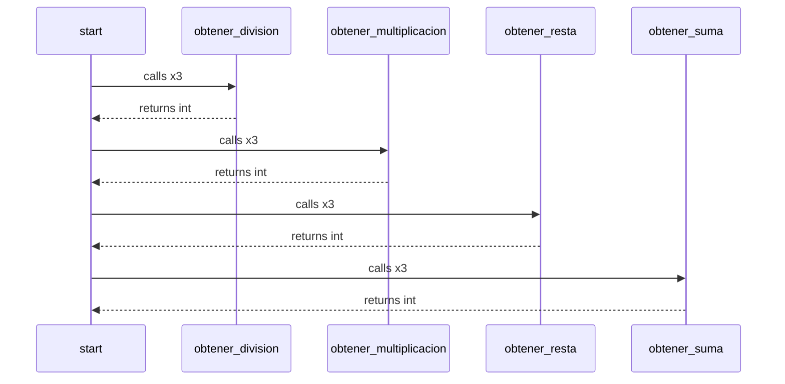

This is a mermaid diagram, you may need to install a [Browser Plugin](https://github.com/BackMarket/github-mermaid-extension) or [VsCode extension](https://marketplace.visualstudio.com/items?itemName=bierner.markdown-mermaid) or similar to view it.

You can also [view it full screen as an SVG](https://mermaid.ink/svg/c2VxdWVuY2VEaWFncmFtCiAgc3RhcnQtPj5vYnRlbmVyX2RpdmlzaW9uOiBjYWxscyB4MwogIG9idGVuZXJfZGl2aXNpb24tLT4+c3RhcnQ6IHJldHVybnMgaW50CiAgc3RhcnQtPj5vYnRlbmVyX211bHRpcGxpY2FjaW9uOiBjYWxscyB4MwogIG9idGVuZXJfbXVsdGlwbGljYWNpb24tLT4+c3RhcnQ6IHJldHVybnMgaW50CiAgc3RhcnQtPj5vYnRlbmVyX3Jlc3RhOiBjYWxscyB4MwogIG9idGVuZXJfcmVzdGEtLT4+c3RhcnQ6IHJldHVybnMgaW50CiAgc3RhcnQtPj5vYnRlbmVyX3N1bWE6IGNhbGxzIHgzCiAgb2J0ZW5lcl9zdW1hLS0+PnN0YXJ0OiByZXR1cm5zIGludAo=)        

